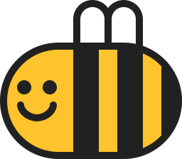

# 🐝 Web UI & UX Final Project 🐝

_transform, transition, animation etc..._ 적용한 기능 및 아이템 소개

_Apply all fonts on a 15px basis. (15px/rem)_

## 📱 Apply Viewport

```html
<meta name="viewport" content="width=device-width, initial-scale=1.0" />
```

## 🛠 Apply MediaQuery

```CSS
@media (min-width: 1300px) { }
@media (max-width: 1300px) { }
@media (max-width: 700px) { }
```

# 𝌞 Contents and Introduction

-   **🍔 Hamburger Menu 🍔**

    -   _HTML_

    ```html
    <div id="menuBtn">
        <div class="Btncontainer">
            <div class="bar1"></div>
            <div class="bar2"></div>
            <div class="bar3"></div>
        </div>
    </div>
    ```

    -   _CSS_

    ```CSS
    .Btncontainer {
        display: inline-block;
        cursor: pointer;
        position: relative;
        top: 0.46rem;
        left: -0.3rem;
    }

    .bar1,
    .bar2,
    .bar3 {
        width: 2.33rem;
        height: 0.33rem;
        background-color: var(--beeYellow);
        margin: 6px 0;
        transition: 0.2s;
    }

    .change .bar1 {
        transform: rotate(-45deg) translate(-9px, 6px);
        /* -45도 회전, x축:-9px, y축:6px 만큼 이동 */
    }
    .change .bar2 {
        opacity: 0;
    }
    .change .bar3 {
        transform: rotate(45deg) translate(-8px, -8px);
        /* 45도 회전, x:-8, y:-8 이동 */
    }
    ```

    -   _JavaScript_

    ```js
    let CurrentMenuValue = 0; // * 메뉴 숨겨있을 때 0, 클릭해서 나타냈을 때 1

    $("#menuBtn").click(() => {
        switch (CurrentMenuValue) {
            case 0:
                $(".Btncontainer").addClass("change");
                $("#navi").animate({ left: 0 }, 200);
                $("#Topmenu, #container").animate({ left: "300px" }, 200);
                CurrentMenuValue = 1;
                break;
            case 1:
                $(".Btncontainer").removeClass("change");
                $("#navi").animate({ left: "-300px" }, 200);
                $("#Topmenu, #container").animate({ left: 0 }, 200);
                CurrentMenuValue = 0;
                break;
        }
        if (CurrentMenuValue == 1) {
            $(".box").click(() => {
                $(".Btncontainer").removeClass("change");
                $("#navi").animate({ left: "-300px" }, 200);
                $("#Topmenu, #container").animate({ left: 0 }, 200);
                CurrentMenuValue = 0;
            });
        }
    });
    ```

*   **🔲 Cube 🔲**

    -   _HTML_

    ```HTML
    <section id="3Dcube">

        <ul id="buttonwrapper">
            <li id="cubeBtn1">1</li>
            <li id="cubeBtn2">2</li>
            <li id="cubeBtn3">3</li>
            <li id="cubeBtn4">4</li>
            <li id="cubeBtn5">5</li>
            <li id="cubeBtn6">6</li>
        </ul>

        <div id="cubewrap">
            <div id="cube">
                <div class="cub1"></div>
                <div class="cub2"></div>
                <div class="cub3"></div>
                <div class="cub4"></div>
                <div class="cub5"></div>
                <div class="cub6"></div>
            </div>
        </div>

    </section>
    ```

    -   _CSS_

    ```CSS
    #cubewrap {
        margin: 0 auto;
        width: 100%;
        display: flex;
        flex-direction: row;
        justify-items: center;
        align-items: center;
        transform-style: preserve-3d;
        transform: rotateX(-12deg) rotateY(-20deg);
        /* 버튼을 누르지 않고도 3d큐브임을 인지시키기 위해 x축 -12도, y축 -20도 회전 */
    }

    #cube {
    	width: 50%;
    	height: 25%;
        animation-timing-function: ease-in-out;
        /* 트랜지션의 진행 속도 조절. ease-in-out은 속도가 점점 증가하는 방식 */
        animation-iteration-count: infinite; /* 반복횟수는 무제한 */
        animation-duration: 10s;
        transform-style: preserve-3d; /* 3D 공간에 배치 */
        transform-origin: 100% 100%;
        /* 회전시킬 축을 결정(right bottom). 기본값은 50% 50% (center) */
    }

    #cube div {
        position: absolute;
        width: 200%;
        height: 0%;
    }

    /* 각 큐브들을 면마다 배치하기 위해 각도 설정 */
    #cube .cub1 {	transform: translatez(0);   }
    #cube .cub2 {	transform: rotatey(90deg) translatez(0);    }
    #cube .cub3 {	transform: rotatey(90deg) rotatex(90deg) translatez(0); }
    #cube .cub4 {	transform: rotatey(180deg) rotatez(90deg) translatez(0);    }
    #cube .cub5 {	transform: rotatey(-90deg) rotatez(90deg) translatez(0);    }
    #cube .cub6 {	transform: rotatex(-90deg) translatez(0);   }

    #cubeimg {
        width: 100%;
        margin-top: -50%;
    }

    /* 2, 5번째는 0.7, 3, 6번째는 0.9, 1, 4번째는 기본(1) 투명도 적용 */
    #cube div:nth-child(3n + 2) {	opacity: 0.7;   }   /* 트랜지션을 확실하게 보여주기 위해*/
    #cube div:nth-child(3n + 3) {  	opacity: 0.9;   }  /* nth-child로 면마다 투명도를 조절 */

    ```

    -   _JavaScript_

    ```js
    /* 반응형에 대비한 css 속성 translateZ 설정 */
    /* translateZ는 args가 커질수록 멀어진다. */

    var wd = $("#cubewrap").width() / 2; /* 반응형 구현을 위한 사이징 */
    // translateZ는 쉽게말해 사용자의 눈과 브라우저의 아이템과의 거리라고 할 수 있다. 값이 커질수록 아이템이 가까이 다가오기 때문에 크기도 커보이는 효과.
    $("#cube > .cub1").css({	transform: "translateZ(" + wd + "px)"   });
    $("#cube > .cub2").css({	transform: "rotateY(90deg) translateZ(" + wd + "px)"  });
    $("#cube > .cub3").css({	transform: "rotateY(90deg) rotateX(90deg) translateZ(" + wd + "px)" });
    $("#cube > .cub4").css({	transform: "rotateY(180deg) rotateZ(90deg) translateZ(" + wd + "px)"    });
    $("#cube > .cub5").css({	transform: "rotateY(-90deg) rotateZ(90deg) translateZ(" + wd + "px)"    });
    $("#cube > .cub6").css({  	transform: "rotateX(-90deg) translateZ(0px) translateZ(" + wd + "px)"   });

    각 큐브버튼 클릭 이벤트 (() => {
        1번 버튼 클릭 시
        $("#cube").css({
            transform: "rotateY(0deg)",
            "transition-duration": "1.5s"
        });

        2번 버튼 클릭 시
        $("#cube").css({
            transform: "rotateY(-90deg)",
            "transition-duration": "1.5s"
        });

        3번 버튼
        $("#cube").css({
            transform: "rotateX(-90deg) rotateY(-90deg)",
            "transition-duration": "1.5s"
        });

        4번 버튼
        $("#cube").css({
            transform: " rotateY(180deg) rotateZ(90deg)", // rotateZ를 사용하면 2d방식의 rotate와 같음. (단순하게 사용자의 시점에서의 평면적인 회전)
            "transition-duration": "1.5s"
        });

        5번 버튼
        $("#cube").css({
            transform: " rotateX(-90deg) rotateY(180deg) rotateZ(90deg)",
            "transition-duration": "1.5s"
        });

        6번 버튼
        $("#cube").css({
            transform: " rotateX(90deg)",
            "transition-duration": "1.5s"
        });
    });
    ```

*   **↻ Rotate ↻**

    -   _HTML_

    ```html
    
    ```

    -   _CSS_

    ```css
    @keyframes rotating {
        /*애니메이션을 재생할 각 프레임의 스타일을 정의 from(0%)에서 시작해서
          to(100%) 속성에 설정한 스타일로 점차 바뀌며 재생*/
        from {
            transform: rotate(0deg);
        }
        to {
            transform: rotate(360deg);
        }
    }

    @keyframes reverse_rotating {
        from {
            transform: rotate(360deg);
        }
        to {
            transform: rotate(0deg);
        }
    }

    .rotationImg {
        width: 30%;
    }

    .rotating {
        animation: rotating 0.4s linear infinite;
        /*rotating이라는 키프레임을 0.4초마다 선형으로 무한반복*/
        transform-origin: center; /*회전의 중심축은 중심으로 세팅*/
    }
    .reverse_rotating {
        width: 30%;
        animation: reverse_rotating 0.4s linear infinite;
        transform-origin: center;
    }
    ```

    -   _JavaScript_

    ```js
    let rotateImg = document.querySelector(".rotationImg");

    rotateImg.addEventListener("click", () => {
        // 클릭할때마다  클래스가 교차되게 토글을 부여함
        rotateImg.classList.toggle("rotating");
        // args로 전달한 클래스명이 있으면 삭제, 없으면 추가
        rotateImg.classList.toggle("reverse_rotating");
    });
    ```

*   **🌀 Following circles 🌀**

    -   _HTML_

    ```html
     <!-- width:340px, height:340px로 정사각형 선언 -->
    <svg class="followingCircle" viewBox="0 0 340 340">
        <!-- 원의 cx와 cy(x,y축의 좌표)는 170으로 viewBox의 340에 맞춰 정가운데에 만들고,
            반지름의 길이를 각각 다르게 설정. -->
        <circle id="circle1" class="circles" cx="170" cy="170" r="160" stroke="#FDF68C" />
        <circle id="circle2" class="circles" cx="170" cy="170" r="135" stroke="#F4CD2A" />
        <circle id="circle3" class="circles" cx="170" cy="170" r="110" stroke="#EDA323" />
        <circle id="circle4" class="circles" cx="170" cy="170" r="85" stroke="#D28D0D" />
        
    </svg>
    ```

    -   _CSS_

    ```css
    .followingCircle {
        max-width: 15rem;
        width: 100%;
        height: auto;
        stroke-linecap: round; /* svg에 관한 css로 선 끝을 동그랗게 처리 */
    }

    circle {
        fill: none;
        stroke-width: 4; /* 두께를 4로 조절 */
    }

    circle:nth-of-type(1) {
        stroke-dasharray: 550px; /* dasharray로 원의 선을 다 채우는 것이 아니라 값만큼만 설정 */
        animation-delay: -0.15s; /* 애니메이션마다 딜레이를 부여해 각각 시작시간을 다르게 세팅 */
    }
    circle:nth-of-type(2) {
        stroke-dasharray: 500px;
        animation-delay: -0.3s;
    }
    circle:nth-of-type(3) {
        stroke-dasharray: 450px;
        animation-delay: -0.45s;
    }
    circle:nth-of-type(4) {
        stroke-dasharray: 300px;
        animation-delay: -0.6s;
    }

    @keyframes bingbing {
        /* 움직임을 위한 키프레임 세팅 */
        50% {
            transform: rotate(360deg);
        }
    }

    .bingbing_active {
        animation-name: bingbing;
        animation-duration: 4s;
        animation-iteration-count: infinite;
        animation-timing-function: ease-in-out;
        transform-origin: 170px 170px; /* viewBox의 중심인 170,170을 이용해 회전축 설정*/
        /* will-change: transform; 페이지의 반응성을 증가시키기 위해
        넣으려 했으나 자료를 찾아본 결과, 복잡한 렌더링을 불러올 수 있어서 주석처리 */
    }
    ```

    -   _JavaScript_
        -   🙅🏻‍♀️ No JavaScript

---

## 그 외의 것들

---

### 🍔햄버거 메뉴를 클릭/터치하여 메뉴가 등장했을 때 <br> 브라우저 크기를 강제적으로 늘렸을 경우의 오류 대비

```js
// 이미 브라우저에서 메뉴가 열려있을 때 resize가 감지되어 그 값이 800보다 커지면
$(window).resize(function () {
    if (CurrentMenuValue == 1) {
        if ($(window).width() >= 800) {
            $("#navi").animate({ left: "-300px" }, 200);
            $("#Topmenu, #container").animate({ left: 0 }, 200);
            $(".Btncontainer").removeClass("change");
            CurrentMenuValue = 0;
        }
    }
});
```

### ⬆️ window.scrollTo는 로고이미지에 적용

```js
const logo = document.querySelector("#logoImg");

logo.addEventListener("click", () => {
    window.scrollTo({ top: document.querySelector("#box1").offsetTop, behavior: "smooth" });
});
```

### ⛔️ 웹 성능 저하 방지

**동작을 하는 아이템들은 <br>_사용자가 인근 컨텐츠_ 를 보고있을때 실행**

```js
setInterval(() => {
    $(window).scroll(() => {
        let browserY = $(document).scrollTop() + 350;
        let CurrentPageNum = 0;
        const page1Y = $("#box1").offset();
        const page2Y = $("#box2").offset();
        const page3Y = $("#box3").offset();
        const page4Y = $("#box4").offset();
        const page5Y = $("#box5").offset();
        const page6Y = $("#box6").offset();
        const page7Y = $("#box7").offset();

        const circle_1 = document.querySelector("#circle1");
        const circle_2 = document.querySelector("#circle2");
        const circle_3 = document.querySelector("#circle3");
        const circle_4 = document.querySelector("#circle4");

        if (browserY < page2Y.top) {
            $(".rotationImg").removeClass("rotating");
            $(".rotationImg").removeClass("reverse_rotating");
        } else if ((browserY >= page2Y.top && browserY <= page3Y.top) || browserY == page2Y.top) {
            $(".rotationImg").addClass("rotating");

            circle_1.classList.remove("bingbing_active");
            circle_2.classList.remove("bingbing_active");
            circle_3.classList.remove("bingbing_active");
            circle_4.classList.remove("bingbing_active");
        } else if ((browserY >= page3Y.top && browserY <= page4Y.top) || browserY == page3Y.top) {
            $(".rotationImg").removeClass("rotating");
            $(".rotationImg").removeClass("reverse_rotating");

            circle_1.classList.add("bingbing_active");
            circle_2.classList.add("bingbing_active");
            circle_3.classList.add("bingbing_active");
            circle_4.classList.add("bingbing_active");
        } else if ((browserY >= page4Y.top && browserY <= page5Y.top) || browserY == page4Y.top) {
            circle_1.classList.remove("bingbing_active");
            circle_2.classList.remove("bingbing_active");
            circle_3.classList.remove("bingbing_active");
            circle_4.classList.remove("bingbing_active");
        }
    });
}, 200);
```

## 🎧 PaperJS

```js
const beeYellow = "#f9c901"; // 자주 쓸 색이라 귀찮아서 상수로 등록
const beeDark = "#242424";

reversePaperColor = () => {
    paper_hair_ItemList = [headphoneLeft, headphoneRight, headphoneTop];
    paper_face_ItemList = [eyeLeft, eyeRight, mouth, microPhone];
    if (reversing == false) {
        reversing = true;
        for (i = 0; i < paper_hair_ItemList.length; i++) {
            paper_hair_ItemList[i].fillColor = beeDark;
            paper_hair_ItemList[i].strokeColor = beeYellow;
        }
        headphoneLine.strokeColor = beeYellow;
        head.fillColor = beeYellow;

        for (i = 0; i < paper_face_ItemList.length; i++) {
            paper_face_ItemList[i].fillColor = beeDark;
            paper_face_ItemList[i].strokeColor = beeDark;
        }
    } else if (reversing == true) {
        reversing = false;
        for (i = 0; i < paper_hair_ItemList.length; i++) {
            paper_hair_ItemList[i].fillColor = beeYellow;
            paper_hair_ItemList[i].strokeColor = beeDark;
        }
        headphoneLine.strokeColor = beeDark;
        head.fillColor = beeDark;

        for (i = 0; i < paper_face_ItemList.length; i++) {
            paper_face_ItemList[i].fillColor = beeYellow;
            paper_face_ItemList[i].strokeColor = beeYellow;
        }
    }
};

const paperItem = document.querySelector("#paperCanvas");
let reversing = false;
paperItem.addEventListener("click", () => {
    reversePaperColor();
});

paper.install(window);
var canvas = document.getElementById("paperCanvas");

paper.setup(canvas);

var headphoneLeft = new Path.Ellipse({
    center: [-30, 50],
    radius: [50, 50],
    fillColor: beeYellow,
    strokeColor: beeDark,
    strokeWidth: 2,
});
var headphoneRight = new Path.Ellipse({
    center: [130, 50],
    radius: [50, 50],
    fillColor: beeYellow,
    strokeColor: beeDark,
    strokeWidth: 2,
});
var headphoneTop = new Path.Ellipse({
    center: [50, 30],
    radius: [100, 100],
    fillColor: beeYellow,
    strokeColor: beeDark,
    strokeWidth: 2,
});
headphoneTop.removeSegment(3);

var head = new Path.Ellipse({
    center: [50, 50],
    radius: [100, 100],
    fillColor: beeDark,
});
var headphoneLine = new Path();
headphoneLine.strokeColor = beeDark;
headphoneLine.strokeWidth = 3;
var start = new Point(155, 55);
headphoneLine.moveTo(start);
headphoneLine.lineTo(155, 150);
headphoneLine.lineTo(75, 150);

var microPhone = new Path.Ellipse({
    center: [75, 150],
    radius: [15, 10],
    fillColor: beeYellow,
    strokeColor: beeDark,
    strokeWidth: 2,
});

var eyeLeft = new Path();
eyeLeft.strokeColor = beeYellow;
eyeLeft.strokeWidth = 15;
eyeLeft.moveTo(10, 15);
eyeLeft.lineTo(10, 55);

var eyeRight = new Path();
eyeRight.strokeColor = beeYellow;
eyeRight.strokeWidth = 15;
eyeRight.moveTo(90, 15);
eyeRight.lineTo(90, 55);

var mouth = new Path.Ellipse({
    center: [50, 90],
    radius: [50, 50],
    fillColor: beeYellow,
});

mouth.removeSegment(1);
var contact = new Group({
    children: [headphoneLine, headphoneTop, headphoneLeft, headphoneRight, head, mouth, microPhone, eyeLeft, eyeRight],
    applyMatrix: false,
});

if (window.matchMedia("(max-width: 700px)").matches) {
    contact.scaling = 0.2;
} else {
    contact.scaling = 0.3;
}
```
